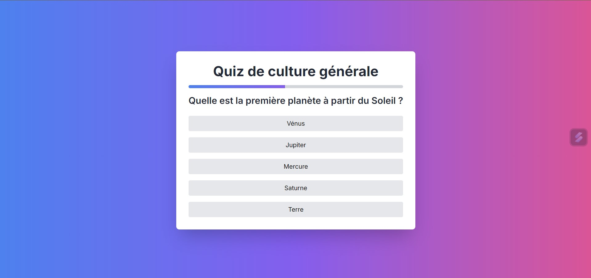
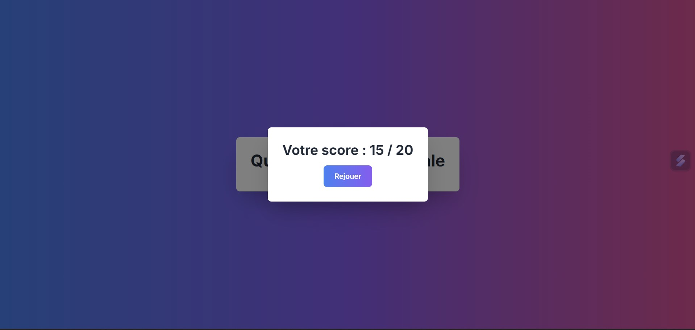
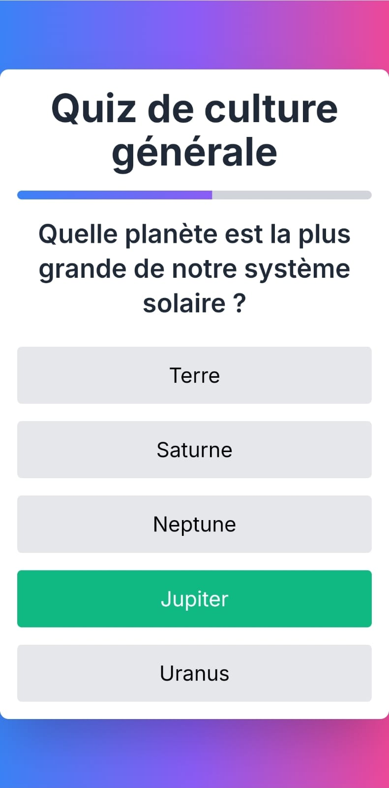

# 🎓 Quiz de Culture Générale 🎓

 

## 📜 Présentation

Bienvenue dans Quiz de Culture Générale ! Ce projet est une application web interactive et moderne qui propose un quiz de 20 questions aléatoires. Que vous soyez un amateur de culture générale ou que vous souhaitiez simplement vous divertir, ce quiz est fait pour vous ! Le Quiz adaptée à tous les appareils, y compris les mobiles ! 📱   

 
 

## ✨ Fonctionnalités Principales   

🎯 Quiz en 20 questions : Testez vos connaissances sur une grande variété de sujets avec 5 choix de réponses à chaque question.   
📊 Barre de progression : Visualisez votre progression à travers le quiz avec une barre de progression dynamique.   
⏱️ Réponses instantanées : Recevez un retour immédiat après chaque réponse avec des indicateurs colorés.   
🏆 Score final : Un récapitulatif de votre performance est affiché à la fin du quiz avec votre score total.   
🎨 Design réactif et animé : Profitez d'une interface moderne et d'animations fluides, adaptée à tous les appareils.   

 
 

## 📸 Aperçu

Voici à quoi ressemble l'application :   

   

   

   

       

 
 

[Démo vidéo du projet sur ordinateur 🎥](https://www.youtube.com/watch?v=R8XSCoCotaI)

[Démo vidéo du projet sur mobile 🎥](https://www.youtube.com/watch?v=8BMlmjy0L6s)

 
 

## 🌐 Lien direct

Pour l'utiliser : [Quiz 🎓](https://gabriellepagnard.github.io/Quizz/)   

 
 

## 🔧 Technologies Utilisées

🖼️ HTML5 : Structure du projet   
🎨 CSS3 avec TailwindCSS : Mise en page stylisée et responsive   
🧠 JavaScript : Gestion de la logique du quiz   
📜 JSON : Stockage des questions et réponses pour le quiz   

 
 

## 📂 Fichiers du Projet

- index.html : Structure principale de l'application   
- style.css : Styles personnalisés en complément de TailwindCSS   
- app.js : Logique du quiz et gestion des réponses   
- questions.json : Base de données des questions du quiz    
- ressources/ : Images, icônes, et autres ressources   

 
 

## 🛠️ Installation et Utilisation

Pour démarrer avec Quiz de culture générale, suivez ces étapes simples :   

➡️ Clonez le Répertoire :   

`git clone https://github.com/votre-utilisateur/Quizz.git`   

➡️ Accédez au Répertoire :   

`cd Quizz`   

➡️ Ouvrez le Fichier "index.html" dans votre navigateur pour voir l'application en action   

➡️ Personnalisez le Code selon vos besoins ou apportez des contributions !   

 
 

## 🏗️ Comment Contribuer

Vous souhaitez contribuer ? 🎉 Voici comment faire :   

### Créer une Branche 🌿

➡️ Pour chaque nouvelle fonctionnalité ou correction, créez une nouvelle branche :   

`git checkout -b nom-de-la-branche`   

### Faire vos Changements ✏️   

Apportez les modifications nécessaires et committez-les :   

`git add .`   
`git commit -m "Description des changements"`   

### Pousser les Changements ⬆️   

Envoyez vos modifications à GitHub 📨 :

`git push origin nom-de-la-branche`   

### Créer une Pull Request 🔄   

Allez sur GitHub, ouvrez une Pull Request et expliquez vos modifications   

 
 

## 🤝 Contributeurs/trices

Gabrielle Pagnard 🧑‍💻 - Créatrice du projet

 
 

## 📧 Contact

Pour toute question ou suggestion, n'hésitez pas à me contacter :   

Email : gpagnard@gmail.com   
GitHub : [GabriellePagnard](https://github.com/GabriellePagnard)     

 
 
 

Avec ce quiz, testez vos connaissances tout en vous amusant ! 🚀🧠   

 
 

Merci d'avoir pris le temps de découvrir ce projet !   
Si vous avez apprécié le quiz, n'hésitez pas à lui donner une étoile ⭐ sur GitHub.   
Votre soutien est grandement apprécié ! 🙏